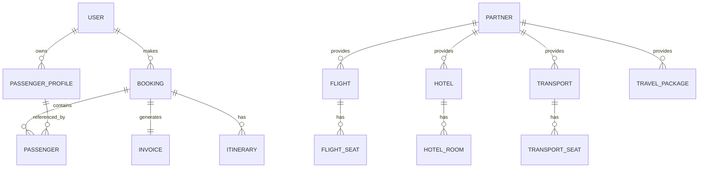
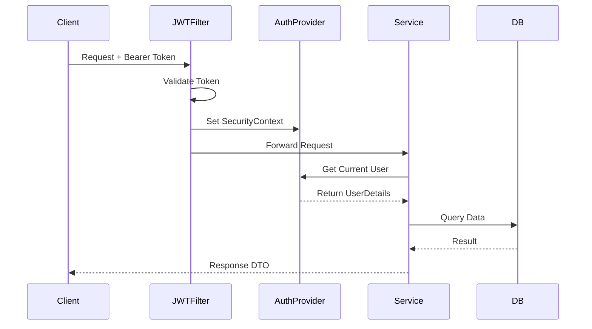
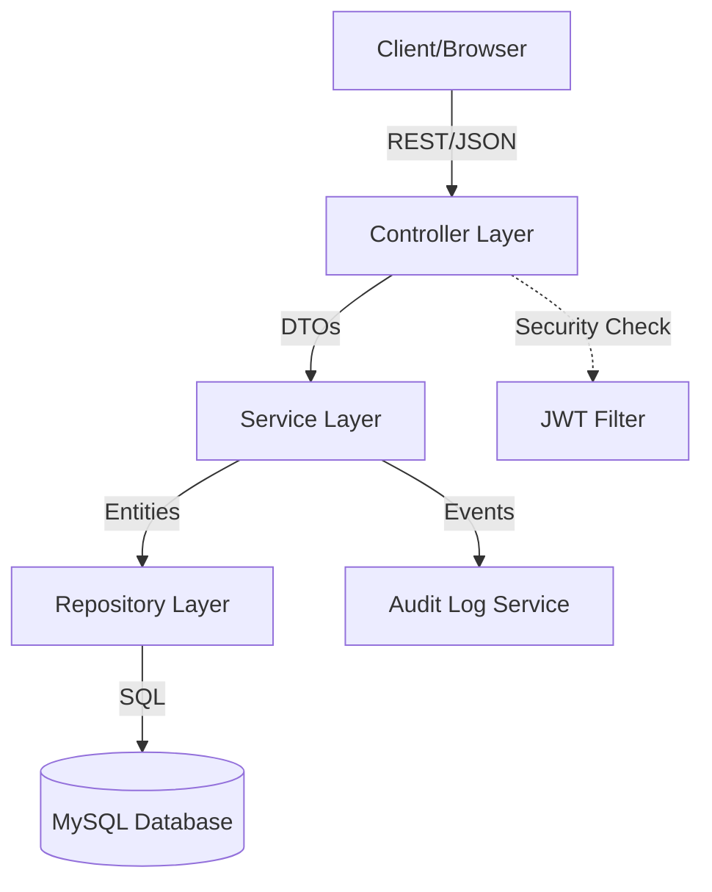

# Travel360 Project Documentation: Technical Handover Manual

## 1. Project Overview

### Project Name
**Travel360** (Monolithic implementation: `travel360endpoints-3`)

### Purpose and Business Objective
Travel360 is a comprehensive travel management system designed to unify the booking process for various travel services. The objective is to provide a single platform where users can search for and book flights, hotels, local transport (buses), and curated travel packages, while managing passenger profiles and financial invoices.

### Main Features
*   **Multi-Modal Booking**: Integrated flow for Flights, Hotels, Transport, and Packages.
*   **Partner Management**: Admin-led management of service providers (Airlines, Hotel chains, etc.).
*   **Passenger Profile Management**: Ability for users to save traveler details for faster future bookings.
*   **Financial Tracking**: Automatic generation of invoices upon booking.
*   **Audit Logging**: Comprehensive AOP-based tracking of all system actions for compliance and debugging.
*   **Role-Based Access Control (RBAC)**: Distinct permissions for Admin, Travel Agents, Finance Officers, and Customers.

### High-Level Architecture
The project follows a **Layered Architecture (N-Tier)**:
1.  **Presentation Layer**: REST Controllers handling HTTP requests/responses.
2.  **Service Layer**: Business logic, validation, and transaction management.
3.  **Data Access Layer**: Spring Data JPA repositories interacting with MySQL.
4.  **Cross-Cutting Concerns**: AOP for auditing, Spring Security for authentication.

### Technology Stack
| Component | Technology | Version |
| :--- | :--- | :--- |
| **Language** | Java | 17 |
| **Framework** | Spring Boot | 3.x |
| **Security** | Spring Security + JWT | - |
| **Database** | MySQL | 8.0+ |
| **ORM** | Hibernate / Spring Data JPA | 6.x |
| **Build Tool** | Maven | - |
| **Utilities** | Lombok, MapStruct | - |
| **API Documentation** | Swagger / OpenAPI | - |

### Package Structure Explanation
*   `com.cts.config`: Infrastructure and security configurations (JWT, Security, Swagger).
*   `com.cts.controller`: REST endpoints defining the API surface.
*   `com.cts.service`: Business logic interfaces.
*   `com.cts.serviceimpl`: Concrete implementations of business logic.
*   `com.cts.repository`: JPA repositories for database interaction.
*   `com.cts.entity`: JPA entities mapping to database tables.
*   `com.cts.dto`: Data Transfer Objects for API request/response payloads.
*   `com.cts.enums`: Type-safe constants for status, roles, and categories.
*   `com.cts.exception`: Custom business exceptions and global error handling.
*   `com.cts.aspect`: AOP logic for system-wide audit logging.
*   `com.cts.util`: Common utility classes and constants.

---

## 2. Application Startup Flow

### Execution Trace
1.  **Main Entry**: `Travel360endpoints3Application` starts.
2.  **Configuration Loading**: Spring Boot scans `@Configuration` classes. `SecurityConfig` initializes the filter chain; `SwaggerConfiguration` sets up API docs.
3.  **Bean Creation**: Spring IoC container instantiates all `@Service`, `@Repository`, and `@Component` beans.
4.  **Security Init**: `JWTFilter` is registered into the Spring Security filter chain to intercept every request.
5.  **Database Init**: Hibernate validates the schema against MySQL.
6.  **Seeder Execution**: Since the app implements `CommandLineRunner` components, they run in the following strict order:
    *   **Order(1) - `DataSeeder`**: Seeds administrative users and test customers.
    *   **Order(2) - `CatalogSeeder`**: Seeds Partners $\rightarrow$ Flights $\rightarrow$ Hotels $\rightarrow$ Transport $\rightarrow$ Packages.
    *   **Order(3) - `BookingSeeder`**: Seeds Passenger Profiles $\rightarrow$ Bookings $\rightarrow$ Invoices.

---

## 3. Database Documentation

### Entity Mapping Table
| Entity | Purpose | Table | Key Fields | Relationships |
| :--- | :--- | :--- | :--- | :--- |
| **User** | System account | `users` | `userId` (PK), `email` (UQ) | 1:N Booking, 1:N PassengerProfile |
| **Partner** | Service Provider | `partner` | `partnerId` (PK) | 1:N Flight/Hotel/Transport/Package |
| **Flight** | Flight inventory | `flight` | `flightId` (PK), `partnerId` (FK) | N:1 Partner, 1:N FlightSeat |
| **Hotel** | Hotel inventory | `hotel` | `hotelId` (PK), `partnerId` (FK) | N:1 Partner, 1:N HotelRoom |
| **Transport** | Bus inventory | `transport` | `transportId` (PK), `partnerId` (FK) | N:1 Partner, 1:N TransportSeat |
| **TravelPackage**| Bundled deals | `travel_package` | `packageId` (PK), `partnerId` (FK) | N:1 Partner |
| **Booking** | Transaction record | `booking` | `bookingId` (PK), `userId` (FK) | N:1 User, N:1 Flight/Hotel/etc, 1:N Passenger |
| **Passenger** | Linkage entity | `passenger` | `passengerId` (PK) | N:1 Booking, N:1 PassengerProfile |
| **PassengerProfile**| Traveler details | `passenger_profile`| `profileId` (PK), `userId` (FK) | N:1 User |
| **Invoice** | Billing record | `invoice` | `invoiceId` (PK), `bookingId` (FK) | N:1 Booking |
| **AuditLog** | System history | `audit_log` | `logId` (PK) | - |

### ER Diagram (Mermaid)

---

## 4. Request Flow Documentation

### Generic Request Lifecycle
**Client** $\rightarrow$ **JWT Filter** (Auth) $\rightarrow$ **Controller** (Request Mapping/Validation) $\rightarrow$ **Service** (Business Logic/Transactions) $\rightarrow$ **Repository** (DB Query) $\rightarrow$ **Database** $\rightarrow$ **Response DTO** $\rightarrow$ **Client**.

### Endpoint Examples
| Method | URL | Request DTO | Validation | Service | Response | Auth |
| :--- | :--- | :--- | :--- | :--- | :--- | :--- |
| `POST` | `/api/bookings/flight` | `BookingFlightDTO` | `@NotNull`, `@Future` | `FlightBookingService` | `BookingFlightResponseDTO` | Authenticated |
| `POST` | `/api/users/register` | `CreateUserDTO` | `@Email`, `@NotBlank` | `UserService` | `UserResponseDTO` | Public |
| `GET` | `/api/search/flights` | `Query Params` | Source/Dest | `SearchService` | `List<FlightResponseDTO>` | Public |

---

## 5. Security Documentation

### Authentication Flow (JWT)
1.  **Login**: User provides credentials $\rightarrow$ `UserService` verifies $\rightarrow$ Server generates JWT signed with secret key.
2.  **Token Storage**: Client stores JWT in LocalStorage/Cookie.
3.  **Authenticated Request**: Client sends `Authorization: Bearer <TOKEN>` in header.
4.  **Interception**: `JWTFilter` intercepts the request $\rightarrow$ Validates token $\rightarrow$ Extracts `userId` and `role`.
5.  **Context Setting**: `SecurityContextHolder` is populated with an `Authentication` object.

### Authorization Flow
*   **RBAC**: Access is controlled via `@PreAuthorize("hasRole('ADMIN')")` or through the `SecurityConfig` filter chain.
*   **User Context**: The `AuthenticatedUserProvider` is used throughout the service layer to ensure a user can only modify their own bookings (e.g., `assertCanActAs(userId)`).

### Security Sequence Diagram

---

## 6. Business Flow Documentation

### Flight Booking Flow
1.  **Search**: User searches for flights $\rightarrow$ `SearchService` filters `Flight` entities by source, destination, and price.
2.  **Selection**: User selects a flight and seat type (e.g., Economy).
3.  **Validation**:
    *   `Flight` must be `SCHEDULED`.
    *   Travel date must be $> 1$ day in the future.
    *   Sufficient seats must be available in the `FlightSeat` table.
4.  **Locking**: The system uses **Pessimistic Locking** (`SELECT ... FOR UPDATE`) on the Flight row to prevent overbooking during concurrent requests.
5.  **Execution**: 
    *   Creates `Booking` record.
    *   Links `PassengerProfiles` to `Passenger` entity.
    *   Generates `Invoice` with `PENDING` status.
    *   Triggers `NotificationService`.

---

## 7. Service Layer Analysis

### Core Services
| Service | Responsibility | Key Methods | Transactional? |
| :--- | :--- | :--- | :--- |
| `UserService` | Account lifecycle | `register()`, `login()` | Yes |
| `FlightBookingService`| Flight transaction | `createFlightBooking()` | Yes (with Locking) |
| `PartnerService` | Provider management | `createPartner()`, `updateStatus()`| Yes |
| `AuditLogService` | System tracking | `logAction()` | Yes |

---

## 8. DTO Documentation

### Example: `BookingFlightDTO`
*   **Purpose**: Captures the request to book a flight.
*   **Key Fields**:
    *   `flightId` (Long): The target flight.
    *   `units` (Integer): Number of seats.
    *   `passengerProfileIds` (List): The travelers' profiles.
*   **Validation**: `@Future` for date, `@NotEmpty` for passengers.

---

## 9. Exception Handling

### Global Strategy
The project uses a `@RestControllerAdvice` (Global Exception Handler) to map Java exceptions to HTTP responses.

| Exception | HTTP Status | Cause |
| :--- | :--- | :--- |
| `ResourceNotFoundException` | 404 Not Found | Entity not in DB |
| `InvalidBookingException` | 400 Bad Request | Business rule violation |
| `InsufficientAvailabilityException`| 409 Conflict | Not enough seats |
| `AccessDeniedException` | 403 Forbidden | Role mismatch / unauthorized |
| `MethodArgumentNotValidException`| 400 Bad Request | DTO validation failure |

---

## 10. Audit Logging

### AOP Implementation
The project uses a `LoggingAspect` to automatically capture every service call without polluting business logic.

**Flow**:
1.  **Around Advice**: Intercepts methods annotated with specific patterns or in the `serviceimpl` package.
2.  **Capture**: Logs the method name and the input arguments.
3.  **Outcome**: If the method succeeds, it logs the return value. If it fails, it logs the exception.
4.  **Persistence**: The `AuditLogService` saves these events into the `audit_log` table.

---

## 11. Complete Booking Journeys

### The Life of a Flight Booking
1.  **User Journey**: Search $\rightarrow$ Select $\rightarrow$ Enter Passengers $\rightarrow$ Confirm.
2.  **API Journey**: `GET /search/flights` $\rightarrow$ `POST /bookings/flight`.
3.  **DB Updates**: 
    *   Insert `Booking` (status=PENDING).
    *   Insert `Passenger` (linked to Booking and Profile).
    *   Insert `Invoice` (amount=seat\_price * units).
4.  **Audit**: `CREATE_BOOKING` event recorded in `audit_log`.

---

## 12. Code Flow Diagrams

### Overall Architecture

---

## 13. Package-by-Package Explanation

*   `controller`: Entry points. Handles request mapping, basic DTO validation, and response wrapping.
*   `service`: Interfaces defining the "What" of the business.
*   `serviceimpl`: The "How". Contains transactional logic, calculations, and repository calls.
*   `repository`: Extends `JpaRepository` for standard CRUD and custom `@Query` methods.
*   `entity`: The source of truth. Defines DB tables and relationships.
*   `dto`: Decouples the DB schema from the API contract.
*   `config`: Spring beans for security, Swagger, and system settings.
*   `aspect`: Logic that "cuts across" multiple services (Audit Logging).
*   `exception`: Domain-specific errors.

---

## 14. Dependency Analysis

*   **Service $\rightarrow$ Repository**: Services depend on repositories to persist data.
*   **Controller $\rightarrow$ Service**: Controllers depend on services to execute business logic.
*   **Booking $\rightarrow$ User/Flight**: Bookings depend on existing users and flights (Foreign Key constraints).
*   **Symmetry**: The project uses the **Dependency Inversion Principle** via interfaces (`FlightService` $\rightarrow$ `FlightServiceImpl`).

---

## 15. Potential Issues & Technical Debt

1.  **N+1 Query Risk**: The `Booking` $\rightarrow$ `Passenger` $\rightarrow$ `PassengerProfile` chain may cause multiple queries. Recommendation: Use `JOIN FETCH` in the repository.
2.  **Transaction Scope**: Ensure `@Transactional` is used on all methods that modify multiple tables (e.g., Booking + Invoice).
3.  **Concurrency**: While `findByIdForUpdate` is used for flights, similar locks are needed for Hotel/Transport inventory to prevent overselling.
4.  **Validation**: DTO validation is strong, but some complex cross-field validations (e.g., check-in vs check-out date) should be explicitly tested.

---

## 16. Developer Learning Notes

### Key Annotations
*   `@Transactional`: Ensures that if the Invoice creation fails, the Booking is also rolled back.
*   `@Savy / @Builder`: Simplifies object creation for complex entities.
*   `@PreAuthorize`: Declarative security to restrict endpoints to Admins.
*   `@RestControllerAdvice`: Centralizes error handling for the entire app.

### common Patterns
*   **DTO Pattern**: Used to avoid exposing the database `User` object (which contains the password) to the API.
*   **Repository Pattern**: Abstracts the database logic, making it easier to switch DBs or mock for tests.

---

## 17. Final Project Handbook

### Quick Start Guide
1.  **Database**: Create a MySQL database named `travel360`.
2.  **Config**: Update `application.properties` with your DB credentials.
3.  **Run**: Start `Travel360endpoints3Application`.
4.  **Verify**: Check logs for "Seeding sample catalog complete."
5.  **Access**: Use Swagger UI at `/swagger-ui.html` to test endpoints.

### Troubleshooting
*   **Access Denied**: Ensure you are passing the JWT token in the `Authorization` header.
*   **No Authenticated User**: Check if the token has expired or if the `userId` in the token exists in the DB.
*   **LazyInitException**: Ensure the service method is marked `@Transactional`.
